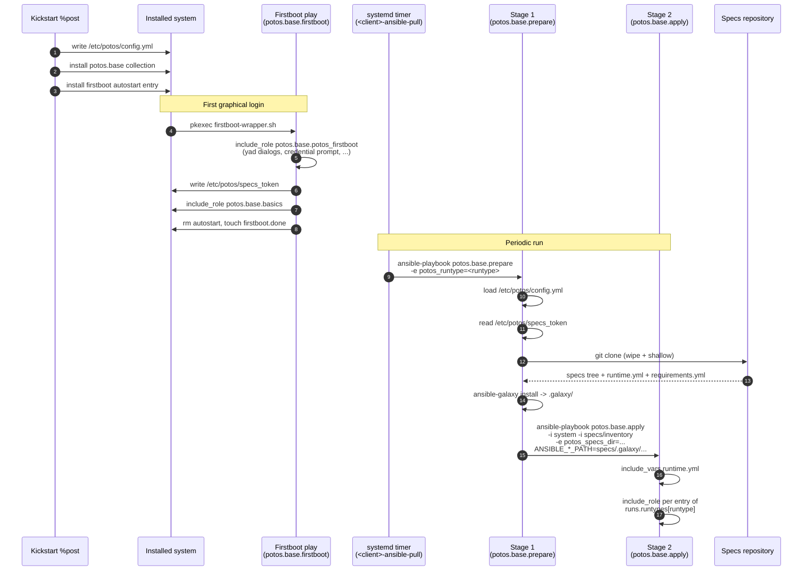

<!-- cspell: ignore CMDB FQDN runtypes -->
# Potos system flow

This document describes how a Potos host is bootstrapped from a kickstart
ISO and then kept in spec by periodic Ansible runs. It is the canonical
"where is X set / how does it reach the next stage" reference.

## TL;DR

- The kickstart `%post` writes **one** YAML file (`/etc/potos/config.yml`)
  that is the single source of truth for the installed system.
- The first graphical login runs the **firstboot** play once. It collects
  any missing credential material and writes them to the filesystem.
- A systemd timer then runs the **periodic** play repeatedly. It is split
  into two stages:
  - **Stage 1 (`potos.base.prepare`)** — bootstrap, clone the specs repo, install
    its `requirements.yml`.
  - **Stage 2 (`potos.base.apply`)** — run the roles the specs repo declares
    for the requested runtype.

## File layout on the installed system

| Path                                             | Owner       | Purpose                                                         |
|--------------------------------------------------|-------------|-----------------------------------------------------------------|
| `/etc/potos/config.yml`                          | kickstart   | Single non-secret system config. Read on every ansible run.     |
| `/etc/potos/specs_token`                         | firstboot   | Token used to clone the specs repo (mode 0400).                 |
| `/etc/potos/ansible_vault_key`                   | operator    | Optional vault password file.                                   |
| `/var/lib/potos/inventory/<client>_inventory`    | firstboot   | One line: `<fqdn> ansible_connection=local`.                    |
| `/usr/share/ansible/collections/...`             | kickstart   | Bundled `potos.base` collection (offline-installable).          |
| `/usr/libexec/potos/credentials.sh`              | kickstart   | Optional credential-source script (only if shipped on the ISO). |
| `/usr/libexec/potos/firstboot-wrapper.sh`        | kickstart   | Autostart entry point for the firstboot play.                   |
| `/usr/local/bin/<client>-ansible-pull`           | base role   | Wrapper invoked by each runtype's systemd timer.                |
| `/var/lib/potos/specs/`                          | stage 1     | Specs repo clone. Wiped + re-cloned on every run.               |
| `/var/lib/potos/specs/.galaxy/`                  | stage 1     | Per-clone collections/roles installed from specs requirements.  |
| `/var/lib/potos/firstboot.done`                  | firstboot   | Marker that prevents firstboot from running twice.              |

## `/etc/potos/config.yml` schema

```yaml
client_name:
  short: potos                  # used for naming (timers, log dirs, ...)
  long: Potos Linux Client

specs:
  url: https://example.com/org/potos-specs.git
  branch: main

role_vars:
  potos_firstboot_credentials_source: openbao   # none | prompt | openbao | script
  potos_firstboot_credentials_openbao:
    url: https://bao.example.com
    role: potos
    mount: oidc
    secret_path: kv/potos/specs
    field: token

# Ansible roles to run AFTER the default firstboot wizard, once.
firstboot_extra_roles: []
```

## Specs-repo contract

The specs repository (cloned to `/var/lib/potos/specs/` on every run) MUST
provide the following layout:

```text
<specs-repo>/
├── requirements.yml        # ansible-galaxy: collections + roles (unified)
├── runtime.yml                # which roles run for each runtype  (REQUIRED)
├── inventory/              # optional - merged with the system inventory
│   ├── hosts.yml
├── host_vars/
│   └── <fqdn>/*.yml
└── group_vars/
    └── <group>.yml
```

### `runtime.yml`

```yaml
runtypes:
  hourly: [mycorp.security.audit]
  daily:  [mycorp.patching.apply, mycorp.security.audit]
```

### Inventory

If `inventory/` is missing the stage-2 run uses the system inventory only.
A warning is printed in that case.

Because stage 2 runs against the FQDN-based inventory, `host_vars/<fqdn>/`
in the specs repo is picked up automatically.

## Variable precedence (low → high)

1. Role defaults (`roles/*/defaults/main.yml`).
2. `/etc/potos/config.yml` → `role_vars`
3. Specs-repo `group_vars/` and `host_vars/<fqdn>/`
4. CLI `-e` extra-vars passed to the wrapper.

## End-to-end flow



## "Where is X set?" quick reference

| Setting                                | Set in                                                     | Read in                              |
|----------------------------------------|------------------------------------------------------------|--------------------------------------|
| Specs repo URL / branch                | kickstart `input/config.yml` → `/etc/potos/config.yml`     | `potos.base.basics` load_config        |
| Client short / long name               | kickstart `input/config.yml` → `/etc/potos/config.yml`     | `potos.base.basics` load_config        |
| Firstboot credential source / openbao  | kickstart `input/config.yml` → `role_vars`                 | `potos.base.potos_firstboot`         |
| Firstboot credential script            | kickstart `input/credentials.sh` (convention; no config)   | `potos.base.potos_firstboot`         |
| Specs token                            | firstboot → `/etc/potos/specs_token`                       | `potos.base.prepare` (stage 1)       |
| Which roles run for a runtype          | specs repo `runtime.yml`                                   | `potos.base.apply` (stage 2)         |
| Per-host overrides                     | specs repo `host_vars/<fqdn>/*.yml`                        | stage 2 via inventory                |
| Per-group overrides                    | specs repo `group_vars/<group>.yml`                        | stage 2 via inventory                |
